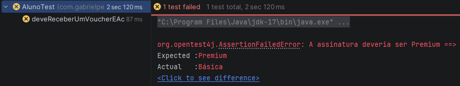
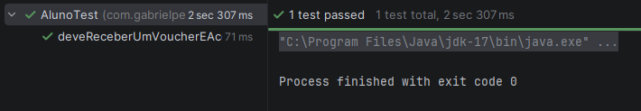
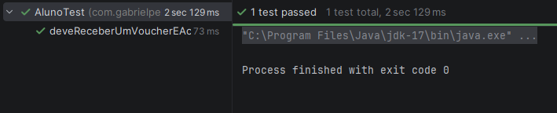
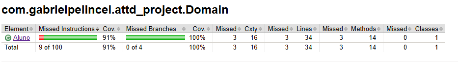
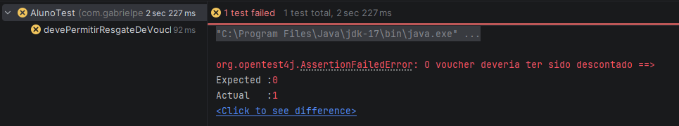
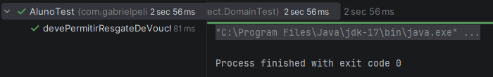
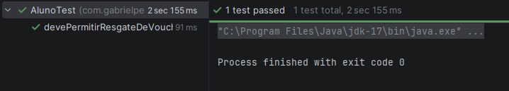
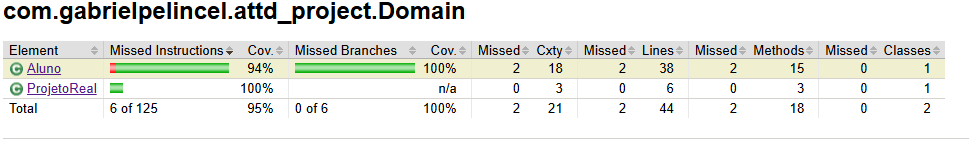

# Educação Continuada Gamificada

## Descrição do Estudo de Caso

Uma determinada plataforma vende cursos online e EAD no modelo de assinaturas. O
aluno paga um valor mensal e tem acesso a um conjunto de cursos para assinatura
básica. A cada curso terminado e com média acima de 7,0, o aluno tem direito a
realização de mais 3 cursos. O aluno que escrever mais tópicos no fórum e ajudar outros
participantes com seus comentários, ganha um curso no final do mês. Quando o aluno
conquistar 12 cursos, seu plano de assinatura passa a ser “Premium” e ele passa a
receber voucher para participar de projetos reais, durante os cursos, e receber 3 moedas,
que podem ser convertidas em conhecimento (novos cursos), acumular ou receber por
criptomoeda.

## User Stories (US)

* **US1 (por Pedro Henrique Santana):** COMO Aluno do nível básico, QUERO que minha assinatura seja alterada para “Premium” automaticamente quando conquistar os 12 cursos PARA ter acesso ao recebimento dos vouchers e moedas.
* **US2 (por Gabriel Pelincel Ramalho):** COMO Aluno do nível Premium, QUERO usar minhas moedas PARA comprar novos cursos.

### US Escolhida

A User Story escolhida para o detalhamento BDD e TDD foi a **US1** (elaborada por Pedro Henrique Santana):

> *COMO Aluno do nível básico, QUERO que minha assinatura seja alterada para “Premium” automaticamente quando conquistar os 12 cursos PARA ter acesso ao recebimento dos vouchers e moedas.*

---

## BDD - Scenarios (Critérios de Aceitação) e Evidências TDD

### Cenário 1: Tornar-se Premium ao completar cursos

**Redigido por:** Pedro Henrique Santana

* **Dado** que o aluno possui 11 cursos conquistados
* **E** possui assinatura básica
* **Quando** conquistar mais 1 curso
* **Então** deverá possuir 12 cursos
* **E** sua assinatura deverá ser alterada
* **E** deve possuir acesso ao recebimento dos voucher

#### 🔴🟢🔵 Evidências TDD (RGB) - Cenário 1

* **RED (Teste Falhando):**
> `[Insira a imagem do print do teste falhando aqui]`


* **GREEN (Teste Passando):**
> `[Insira a imagem do print do teste passando aqui]`


* **BLUE (Refatoração e 100% de Cobertura):**
> `[Insira a imagem do print de cobertura de testes aqui]`


---

### Cenário 2: Receber moedas como Premium

**Redigido por:** Pedro Henrique Santana

* **Dado** que o aluno possui 11 cursos conquistados
* **E** possui assinatura básica
* **Quando** conquistar mais 1 curso
* **Então** terá sua assinatura alterada
* **E** receber 3 moedas

#### 🔴🟢🔵 Evidências TDD (RGB) - Cenário 2

* **RED (Teste Falhando):**
> `[Insira a imagem do print do teste falhando aqui]`


* **GREEN (Teste Passando):**
> `[Insira a imagem do print do teste passando aqui]`


* **BLUE (Refatoração e 100% de Cobertura):**
> `[Insira a imagem do print de cobertura de testes aqui]`


---

### Cenário 3: Receber voucher e acesso a projetos reais

**Redigido por:** Gabriel Pelincel Ramalho

* **Dado** que o aluno possui 11 cursos conquistados
* **E** possui assinatura básica
* **Quando** conquistar mais 1 curso
* **Então** terá sua assinatura alterada
* **E** receber 1 voucher
* **E** ter acesso a projetos reais, durante os cursos

#### 🔴🟢🔵 Evidências TDD (RGB) - Cenário 3
* **Teste Unitário:**
````
@Test
    public void deveReceberUmVoucherEAcessoAProjetosReaisAoTornarPremium() {
        Aluno aluno = new Aluno();
        aluno.setAssinatura("Básica");
        aluno.setCursosConquistados(11);
        aluno.setVouchers(0);

        aluno.conquistarCurso();

        assertEquals("Premium", aluno.getAssinatura(), "A assinatura deveria ser Premium");
        assertEquals(1, aluno.getVouchers(), "O aluno deveria ter recebido 1 voucher");
        assertTrue(aluno.isAcessoProjetosReais(), "O aluno deveria ter acesso a projetos reais");
    }
````
* **RED (Teste Falhando):**



* **GREEN (Teste Passando):**



* **BLUE (Refatoração e 100% de Cobertura):**

Teste Refatorado para garantir maior cobertura:
````
@Test
    public void deveReceberUmVoucherEAcessoAProjetosReaisAoTornarPremium() {
        Aluno aluno = new Aluno();
        aluno.setAssinatura("Básica");
        aluno.setCursosConquistados(10);
        aluno.setVouchers(0);
        aluno.setMoedas(0);
        aluno.setAcessoVouchers(false);

        aluno.setAcessoProjetosReais(false);

        aluno.conquistarCurso();

        aluno.conquistarCurso();

        aluno.conquistarCurso();

        assertEquals(13, aluno.getCursosConquistados());
        assertEquals("Premium", aluno.getAssinatura());
        assertTrue(aluno.isAcessoProjetosReais());
    }
````


---

### Cenário 4: Resgatar voucher em projeto real

**Redigido por:** Gabriel Pelincel Ramalho

* **Dado** que o aluno possui 11 cursos conquistados
* **E** possui assinatura básica
* **Quando** conquistar mais 1 curso
* **Então** terá sua assinatura alterada
* **E** receber 1 voucher
* **E** resgatar 1 voucher em 1 projeto real

#### 🔴🟢🔵 Evidências TDD (RGB) - Cenário 4
* **Teste Unitário:**
````
@Test
    public void devePermitirResgateDeVoucherEmProjetoRealAposTornarPremium() {
        Aluno aluno = new Aluno();
        aluno.setAssinatura("Básica");
        aluno.setCursosConquistados(11);
        aluno.setVouchers(0);

        aluno.conquistarCurso();

        ProjetoReal projeto = new ProjetoReal();
        aluno.resgatarVoucher(projeto);

        assertEquals("Premium", aluno.getAssinatura());
        assertEquals(0, aluno.getVouchers(), "O voucher deveria ter sido descontado");
        assertTrue(projeto.isVoucherAplicado(), "O projeto deveria estar com o voucher aplicado");
    }
````
* **RED (Teste Falhando):**



* **GREEN (Teste Passando):**



* **BLUE (Refatoração e 100% de Cobertura):**

Teste Refatorado para garantir maior cobertura:
````
@Test
    public void devePermitirResgateDeVoucherEmProjetoRealAposTornarPremium() {
        Aluno aluno = new Aluno();
        aluno.setAssinatura("Básica");
        aluno.setCursosConquistados(11);
        aluno.setVouchers(0);

        ProjetoReal projetoSemSaldo = new ProjetoReal();
        ProjetoReal projetoComSaldo = new ProjetoReal();

        aluno.resgatarVoucher(projetoSemSaldo);
        assertFalse(projetoSemSaldo.isVoucherAplicado(), "Não deve aplicar voucher se não tiver saldo");

        aluno.conquistarCurso();

        aluno.resgatarVoucher(projetoComSaldo);

        assertEquals("Premium", aluno.getAssinatura(), "A assinatura deveria ser Premium");
        assertEquals(0, aluno.getVouchers(), "O voucher deveria ter sido descontado");
        assertTrue(projetoComSaldo.isVoucherAplicado(), "O voucher deveria ter sido aplicado no projeto");
    }
````

